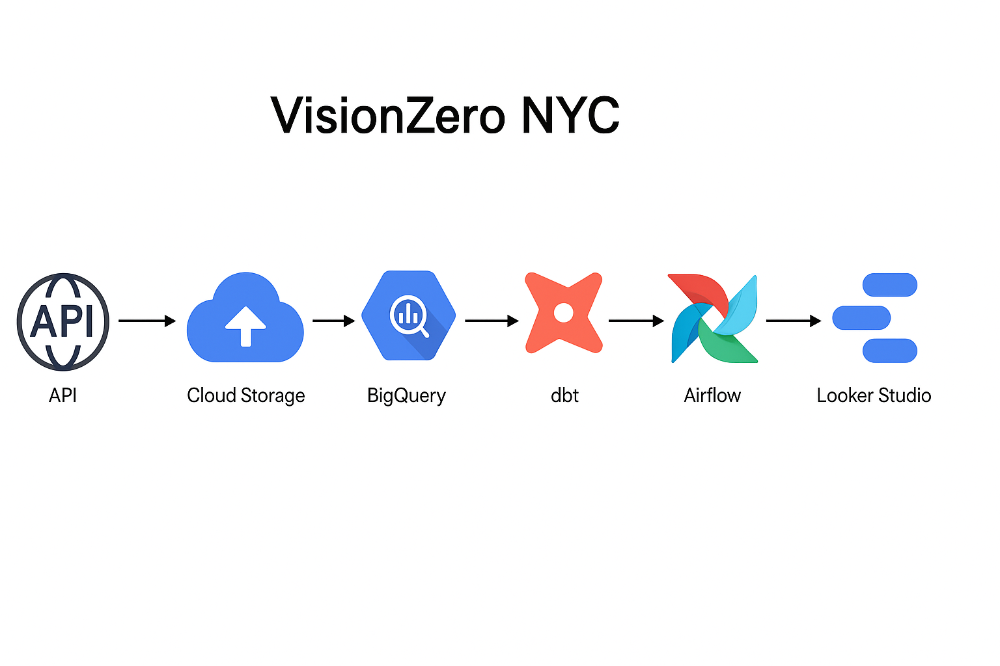

# 🚦 VisionZero NYC Traffic Collision Analysis

This project analyzes traffic collision data in New York City as part of the **Vision Zero initiative**, using a modern data engineering stack with **Airflow**, **dbt**, **BigQuery**, and **Looker Studio**. It showcases how to build a fully automated, containerized data pipeline that transforms raw data into actionable insights for public safety.

---
## Architecture Diagram


## 🔧 Tools & Technologies

- **Apache Airflow (Dockerized)** – Orchestration of ELT workflows
- **dbt (Data Build Tool)** – Modular SQL transformation and testing
- **Google Cloud Storage (GCS)** – Storage for raw CSV data
- **BigQuery** – Cloud data warehouse for scalable analytics
- **Looker Studio** – Dashboard for interactive visualization
- **Python** – Custom data loading scripts and Airflow DAGs

---

## 📁 Project Structure

```plaintext
visionzero-nyc-traffic-analysis/
│
├── dags/                     # Airflow DAGs and Python scripts
├── dbt/                      # dbt transformation project
│   ├── models/
│   ├── snapshots/
│   └── dbt_project.yml
├── gcp/                      # GCP config or loading scripts (if any)
├── dashboard/                # Dashboard screenshots and public link
│   ├── dashboard_screenshot.png
│   └── looker_studio_link.txt
├── docker-compose.yaml       # Docker setup for Airflow
├── Dockerfile                # Dockerfile for custom containerization
├── requirements.txt          # Python dependencies
├── README.md                 # Project overview (this file)
├── LICENSE                   # MIT License (optional)
└── .gitignore                # Ignore unnecessary and sensitive files
